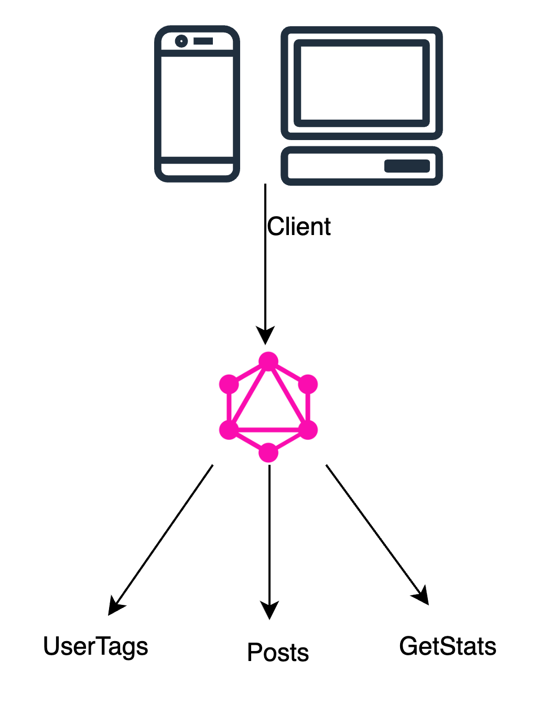

2023-09-17 12:58
Status: #Idea
Tags: #

# Velog 총 조회수를 알아보자

## Velog

지금 이 글을 보고 있는 곳.

블로깅 서비스를 제공하고 있다.

Tag와 시리즈를 통하여 글들을 관리할 수 있다.

다만 불편한 점은 해당 게시글에 대한 조회수를 알 수 없다는 것이다.

영감을 받은 글은, 노드를 이용한 조회수를 알아낼 수 있는 프로젝트였다.

나도 한번 만들어보자

## 분석

Velog는 GraphQL을 이용하여 데이터를 제공한다.

GraphQL은 페이스북에서 만든 쿼리 언어이다. 쿼리 언어하면 떠오르는 SQL이 떠올랐다면 정확한 접근이다. 다만 SQL과는 구조적 차이를 보인다.

SQL은 데이터베이스에 저장된 데이터를 효율적으로 가져오려는 목적을 갖고 있지만, GraphQL은 웹 클라이언트가 데이터를 서버로부터 효율적으로 가져오는 것을 목적으로 한다.

간단하게 말하면, SQL은 보통 백엔드 서버에서 작성하여 데이터베이스에 접근하는데 사용되고, GraphQL은 클라이언트에서 작성하고 사용한다.

GraphQL에 대한 설명은 여기까지하고, Velog의 GraphQL을 살펴보자.

Velog의 base url은 `https://v2cdn.velog.io/graphql` 이다.

우리가 사용할 쿼리는 `UserTags`, `Posts`, `GetStats` 이다.

[velog 깃허브](https://github.com/velopert/velog-server/tree/master)에서 쿼리를 살펴보자

### UserTags

[`UserTags`](https://github.com/velopert/velog-server/blob/master/src/graphql/tag.ts#L71)쿼리는 사용자가 지정했던 태그들의 목록을 가져온다.

필요한 `variable`은 `username`이다.

posts_count와 tags를 가져온다. tags는 tag배열이다.

우리는 이 tag에서 name을 사용한다.

### Posts

[`Posts`](https://github.com/velopert/velog-server/blob/master/src/graphql/post.ts#L449)쿼리는 사용자가 tag를 부여한 글들의 목록을 가져온다.

주의할 점은 limit 100에 한정되어 있다. 즉 같은 tag로 100개 이상의 글은 가져오지 못한다는 점이다.

필요한 `variable`은 `username`과 `tag`이다. `tag`는 `UserTags`쿼리에서 가져온 `name`이다.

posts를 가져온다. posts는 post배열이다.

우리는 이 post에서 id를 사용한다.

### GetStats

[`GetStats`](https://github.com/velopert/velog-server/blob/master/src/graphql/post.ts#L731)쿼리는 글의 조회수를 가져온다.

필요한 `variable`은 `id`이다. `id`는 `Posts`쿼리에서 가져온 `id`이다.

total을 가져온다. 조회수를 의미한다.

## 구현

UserTags -> Posts -> GetStats 순으로 쿼리를 날려야한다.

아쉬운 점은, Tag가 없는 글은 조회수를 알 수 없다는 것이다.

주의할 점은, Posts 쿼리에서 가져온 posts들은 tag별로 가져오게 되므로, 중복된 값이 있을 수 있다.

따라서 GetStats쿼리가 중복해서 호출되지 않게 posts의 중복을 제거해야한다.

코드는 다 짰는데 리팩토링 중이...다.

[리포지터리](https://github.com/doxxx93/velog-total-view)

---

# References
